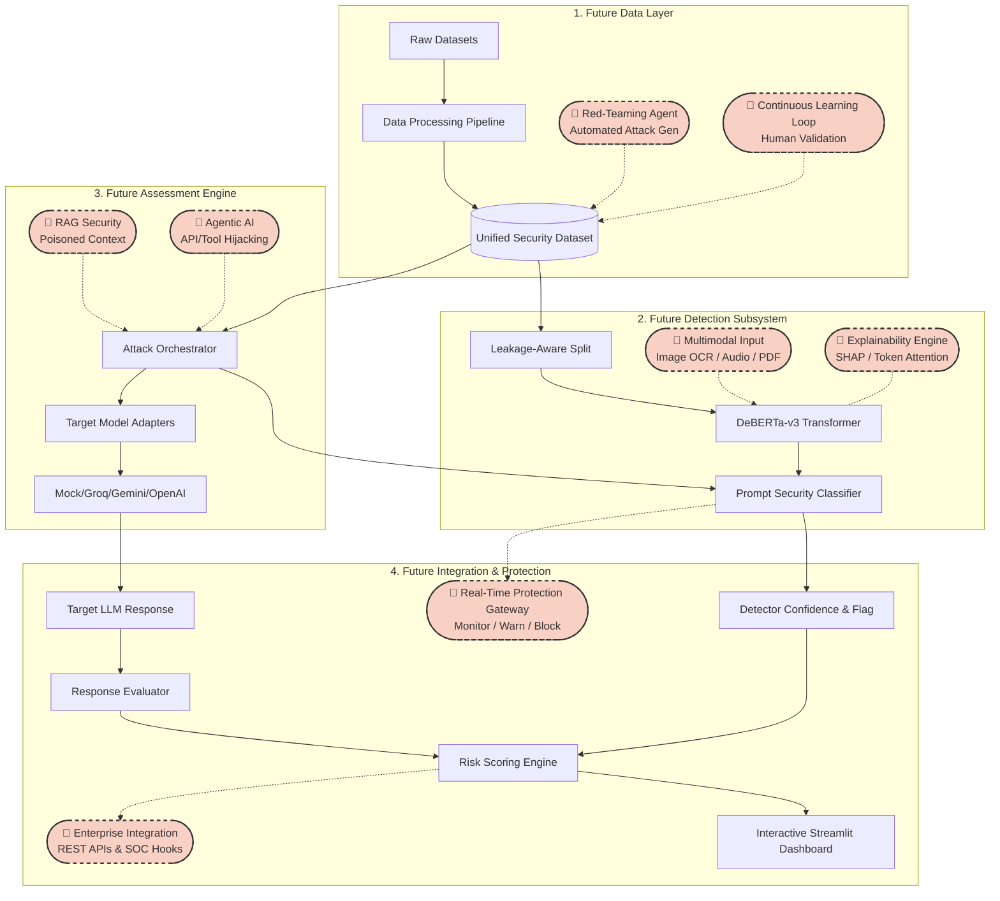

# System Architecture

## Overview
The **LLM Security Assessment Framework** is an end-to-end security auditing and prompt defense platform designed to evaluate and harden Large Language Models against prompt injections, jailbreaks, and leakage attacks.

### Future State Architecture
This diagram visualizes how the 🚀 **Future Scope** components will integrate into the existing framework to create a comprehensive enterprise security platform.

## Core Modules

### 1. Data Processing (`src/data_processing/`)
*   **Normalization & Cleansing:** Handles missing values, standardizes text encoding, and unifies schemas across diverse datasets.
*   **Taxonomy Mapping:** Automatically categorizes prompts into 5 distinct classes (Benign, Prompt Injection, Indirect Prompt Injection, Jailbreak, Prompt Leakage).
*   **Difficulty Scoring & Transformation:** Evaluates prompt complexity (obfuscation, multi-turn) and dynamically generates paraphrased or role-based adversarial variants.
*   **Leakage-Aware Splitting:** Ensures near-duplicate prompts are not split across training and testing sets, preserving the integrity of "novel" attack evaluations.
*   🚀 **Future Scope:** **Automated Attack Generation** (a red-teaming agent to dynamically mutate and produce novel variants) and a **Continuous Learning Loop** (to automatically ingest human-validated failures back into the training data).

### 2. Detection Subsystem (`src/detection/` & `src/models/`)
*   **Baselines:** Extremely fast, lightweight statistical models (`tfidf_lr`, `tfidf_svm`) used for rapid testing and benchmarking.
*   **DeBERTa-v3:** The flagship deep-learning model (Decoding-enhanced BERT). Fine-tuned on the unified dataset to understand complex linguistic nuances.
*   **Multi-Task Capable:** Deploys both a binary classifier (safe vs malicious) and a multi-class taxonomy classifier.
*   🚀 **Future Scope:** **Multimodal Security** (extending the detector to analyze OCR from images, PDFs, and audio transcripts) and **Explainability** (implementing SHAP and attention visualizations to highlight the exact malicious tokens).

### 3. Assessment Engine (`src/assessment/`)
*   **Target Model Adapters (`model_adapter.py`):** An extensible abstraction layer that routes adversarial payloads to various LLMs. It natively supports local HuggingFace pipelines, deterministic offline mock models, and live commercial endpoints (Groq, Gemini, OpenAI).
*   **Response Evaluator (`response_evaluator.py`):** Uses heuristic and rule-based logic to parse the target LLM's response. It accurately determines if the model safely refused the prompt (`BLOCKED`) or complied with the malicious instruction (`BREACHED`).
*   **Risk Scoring Engine (`src/assessment/risk_scoring.py`):** A dynamic formula that calculates a final risk tier (Low, Medium, High, Critical) by combining the attack's inherent severity, the detector's confidence, and whether the target LLM was successfully breached.
*   🚀 **Future Scope:** **RAG Security** (testing for malicious instructions hidden inside retrieved documents) and **Agentic AI Assessment** (evaluating if prompt injections can force an LLM agent to make unauthorized API calls or tool invocations).

### 4. Interactive Presentation & Integration (`app/`)
*   **Streamlit Dashboard:** A comprehensive frontend UI (`app/dashboard.py`) that visualizes the assessment results. It features an interactive dataset explorer, performance metric tables, and a Live Attack Detector for real-time prompt analysis.
*   🚀 **Future Scope:** **Real-Time Protection Gateway** (deploying the detector as a live middleware reverse-proxy with 'Monitor', 'Warn', and 'Block' modes) and **Enterprise Integration** (REST APIs and SIEM hooks for SOC teams).
